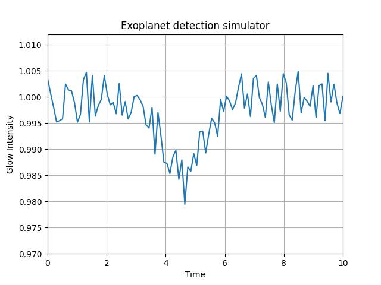

# Detect Exoplanets Simulation

This program is an **exoplanet detection simulator**. As its name suggests, it is used to detect exoplanets, and it has a **10% chance of detecting one**.

this is an example:

